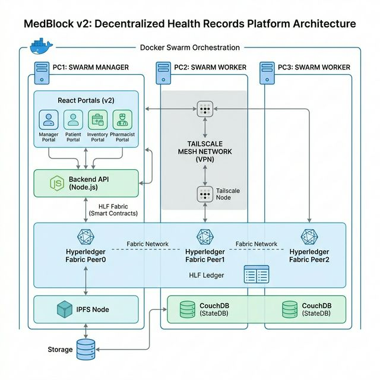
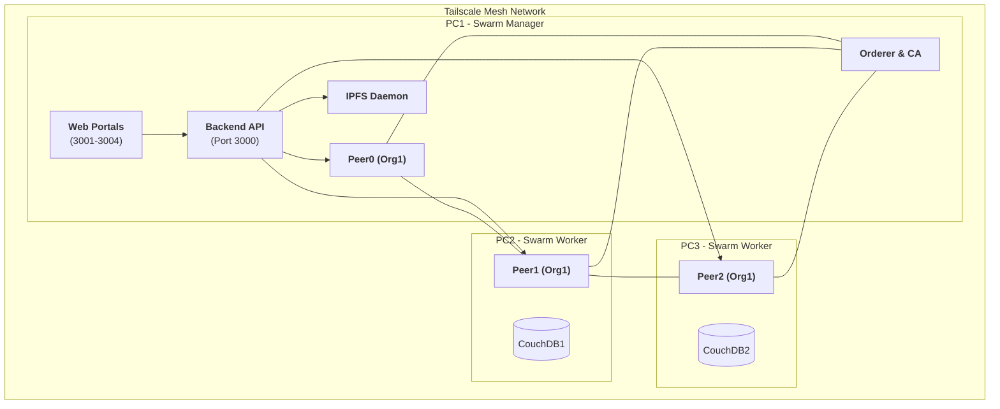

# 🏥 MedBlock v2: Enterprise EHR Platform (Swarm Edition)

MedBlock v2 is a decentralized Electronic Health Records (EHR) platform built on **Hyperledger Fabric v2.5** and **Docker Swarm**. It features a multi-node distributed network, IPFS for secure document archival, and a suite of role-specific glassmorphic web portals.

---

## 🏗️ Architecture Overview





The system operates as a **Docker Swarm** stack across three primary nodes connected via a **Tailscale** mesh network:

| Node | Role | Components | IP Address |
| :--- | :--- | :--- | :--- |
| **PC1** | Manager | Orderer, Org1 Peer0, CA, Backend, IPFS, All Frontends | `100.124.176.94` |
| **PC2** | Worker | Org1 Peer1, CouchDB1 | `100.83.121.98` |
| **PC3** | Worker | Org1 Peer2, CouchDB2 | `100.117.138.55` |

### Key Technologies:
- **Blockchain**: Hyperledger Fabric (Channel: `mychannel`, Chaincode: `ehr`)
- **Storage**: IPFS (InterPlanetary File System) for medical records attachment.
- **Orchestration**: Docker Swarm for multi-node container management.
- **Frontend**: React + Vite with a modern premium design system.
- **Backend**: Node.js + Fabric SDK with identity-based routing.

---

## 🚀 Quick Start

### 1. Prerequisites
- **Tailscale**: Ensure all nodes are logged into the same Tailnet and can ping each other.
- **Docker Swarm**: PC1 must be the Swarm Manager; PC2 and PC3 joined as Workers.
- **Port Visibility**: Node 3000-3004 must be open on PC1.
- **Fabric Binaries**: Located at `/home/ankit/fabric-network/fabric-samples/bin`.

### 2. One-Click Deployment
On **PC1 (Manager)**, run the following command to deploy the entire stack:
```bash
bash deploy.sh
```
*This script automates: wiping old data, starting IPFS, deploying Fabric stacks, syncing artifacts to workers, joining channels, committing chaincode, and starting all apps.*

### 3. Verify Deployment
Check service status across the Swarm:
```bash
bash scripts/swarm_status.sh
```

---

## 📂 Project Structure

```text
.
├── app/                  # Web Portals & Backend
│   ├── backend/          # Node.js API Gateway (Fabric SDK)
│   ├── manager/          # Administrator Dashboard
│   ├── employee/         # Pharmacist/Billing Portal
│   ├── inventory/        # Stock Management Portal
│   └── patient/          # Patient Self-Governance Portal
├── chaincode/            # Smart Contract (EHR logic)
├── compose/              # Docker Swarm Stack Files (*.yaml)
├── crypto-config/        # Fabric Network Identities & Certificates
├── scripts/              # Operational & Maintenance Scripts
└── docs/                 # Detailed Technical Runbooks
    ├── DEPLOYMENT_AND_RECOVERY.md  # 📘 MASTER GUIDE (Start Here)
    └── 10-recovery-runbook.md
```

---

## 🌐 Service Map & Access

The following services are hosted on **PC1** and accessible across the network:

| Portal | URL | Description | Default Test Account |
| :--- | :--- | :--- | :--- |
| **Manager UI** | `http://<PC1-IP>:3001` | System & User Management | `admin` |
| **Pharmacist** | `http://<PC1-IP>:3002` | Prescriptions & Billing | `ph_alice` |
| **Inventory** | `http://<PC1-IP>:3003` | Hospital Stock Management | `inv_bob` |
| **Patient UI** | `http://<PC1-IP>:3004` | Personal Health Records | `pat001` |
| **Backend API** | `http://<PC1-IP>:3000` | Fabric/IPFS Interface | - |
| **IPFS Gateway**| `http://<PC1-IP>:8080` | Document Retrieval | - |

---

## 🛠️ Operational Commands

| Objective | Command |
| :--- | :--- |
| **Full Restart** | `bash deploy.sh` |
| **Restart Apps Only**| `bash deploy.sh --apps-only` |
| **Stop Everything** | `bash scripts/stop_all_swarm.sh` |
| **Sync Workers** | `bash scripts/sync_project_to_workers.sh` |
| **Seed Test Data** | `bash scripts/seed_dummy_data.sh` |
| **Verify Sync** | `bash scripts/verify_sync.sh` |

---

## 🔒 Security Note
- **Identities**: All transactions are signed by cryptographically signed identities stored in `/app/backend/wallet`.
- **Isolation**: This Swarm version is isolated from the local single-PC Fabric network to prevent port collisions.
- **Tailscale**: Communication between Docker nodes is encrypted through the Tailscale Wireguard mesh.

---
