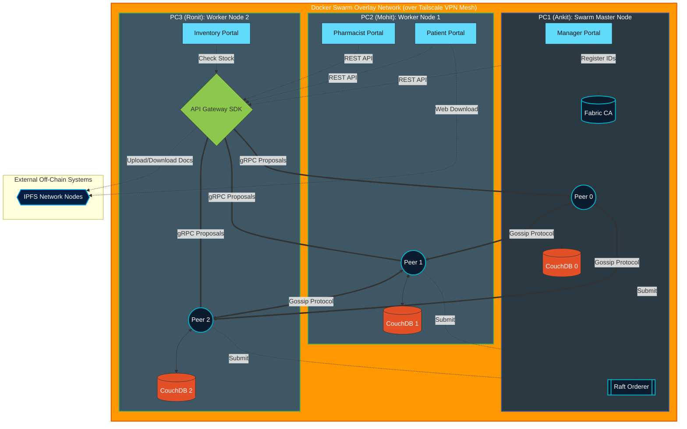

# MedBlock v2: Complete System Architecture

This architectural diagram maps out your entire technical stack exactly as it is deployed across the three physical machines. You can screenshot this and put it directly into your presentation or report!

### The Comprehensive Architecture Map

---

### How to explain this Diagram in your Presentation:

1. **The Boundary Shell (The VPN/Swarm):** Point to the large outer box. Explain that because your laptops are scattered, you created a **Tailscale VPN Mesh** to act as a virtual LAN, allowing Docker Swarm to spin an "Overlay Network" across all machines to encrypt traffic.
2. **The Components on PC1 (Ankit):** Point out how PC1 acts as the "Brain". It holds the **Orderer** (for consensus) and the **Fabric CA** (for identity). It also holds the Manager UI capable of pinging the CA to mint certificates.
3. **The Components on PC2 (Mohit):** Point to PC2. Explain that it holds **Peer1** and its **CouchDB**. It runs the clinical-facing apps (Patient and Pharmacist).
4. **The Gateway Centralization (Ronit's PC3):** Trace the arrows from the 4 React Apps (Manager, Patient, Pharmacist, Inventory). Point out how they ALL route to the green hexagon **(API Gateway)** on PC3. Explain that the Gateway uses the Fabric SDK to change standard REST web-calls into binary `gRPC Proposals` that are securely fired at all three Peers.
5. **The Off-Chain Layer (IPFS):** Look below at the External box. Show how the API connects to IPFS. Explain that large PDFs never touch the internal Fabric Swarm directly. They are pumped into IPFS, and only the cryptographically secure *Hash* payload is sent into the Blockchain.
