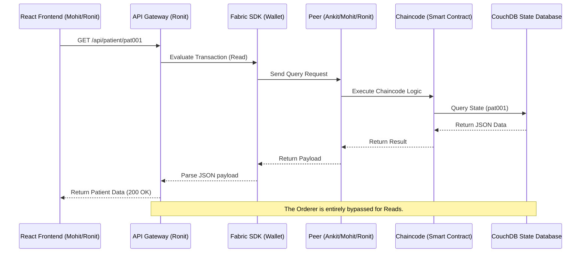
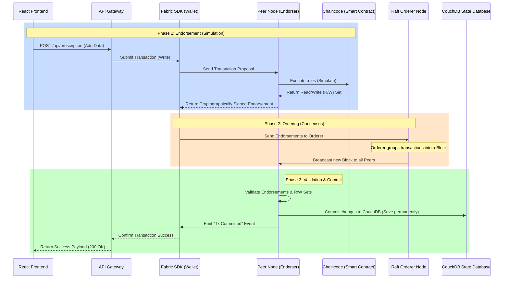

# Hyperledger Fabric Transaction Layers

These diagrams perfectly illustrate the difference between simply reading from the blockchain and writing to it. Show these in your presentation to explain how data traverses the different network layers.

### 1. Read Transaction Process (Fast & Simple)

A Read transaction only queries the current state. It **does not** change any data, so it completely bypasses the Orderer. This is called an `evaluateTransaction` in the Fabric SDK.

---

### 2. Write Transaction Process (Execute-Order-Validate)

A Write transaction (e.g., adding a prescription) alters the permanent blockchain state. Unlike normal databases, Fabric uses a unique 3-step architecture: **1. Endorse (Execute), 2. Order, 3. Commit (Validate).** This is called an `submitTransaction` in the Fabric SDK.

### Explaining this to the Professor
**Read vs Write:** "If you look at the diagrams, you can see CouchDB is just the final layer. The React app never touches CouchDB. For a Read, the Fabric SDK simply asks the Peer to run the Chaincode, which gets the data from CouchDB. 
For a Write, we have to endure the complex 3-step 'Execute-Order-Validate' flow to mathematically ensure the whole decentralized Swarm agrees before anything is permanently written to CouchDB."
